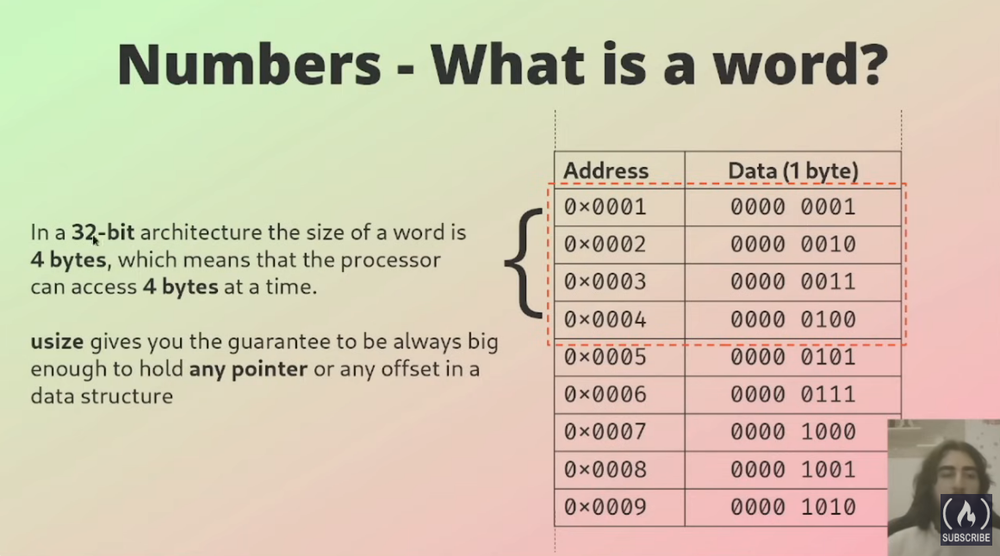
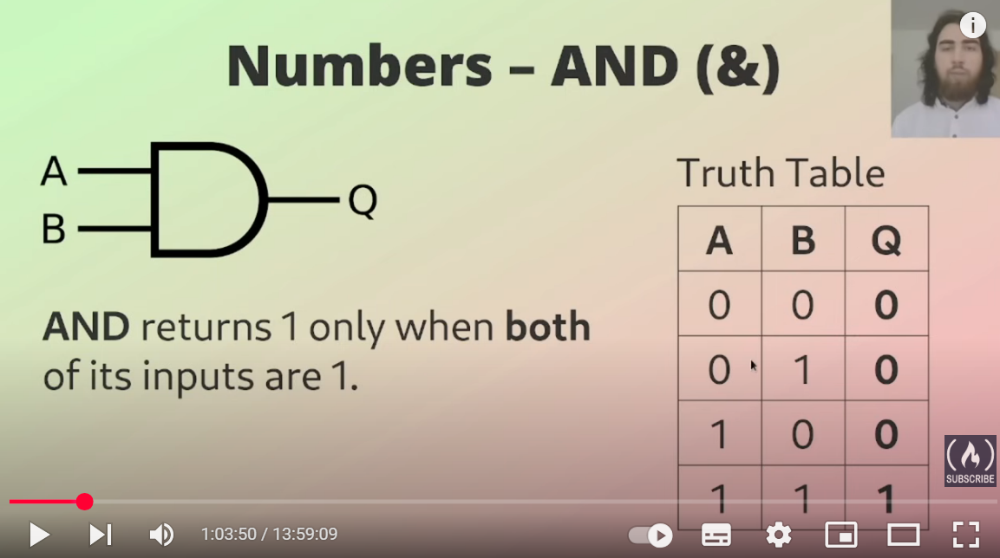
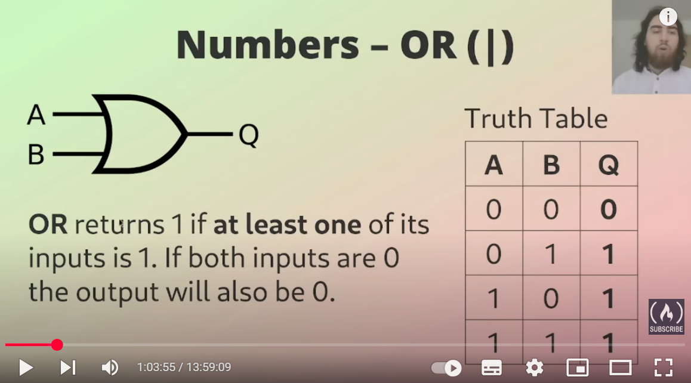
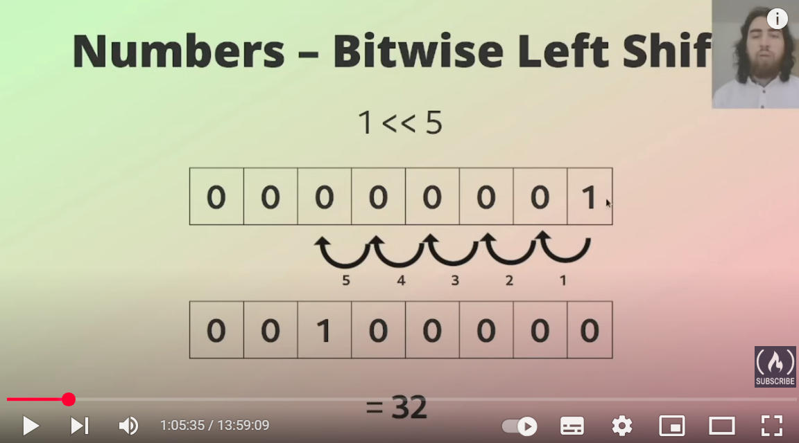

# [Youtube Course](https://www.youtube.com/watch?v=BpPEoZW5IiY)
## Variables
1. A variable can be used only if it has been initialized.
    
    Ở dòng bên dưới, nếu dòng `let x: i32;` chưa khai báo giá trị cho `x` thì sẽ xảy ra lỗi.

    Với dòng khai báo `y`, do biến `y` không được sử dụng nên cũng sẽ có warning, hoặc có thể khai báo như cách được comment bên dưới để không bị warning. Ngoài ra, có thể dùng `allow(unused_variables)` như ví dụ bên dưới.

    ```rs
    fn main() {
        let x: i32 = 5;
        let y: i32;
        // let _y: i32;

        assert_eq!(x, 5);
        println("Success!");
    }
    ```

    ```rs
    #[allow(unused_variables)]
    fn main() {
        let x = 1;
    }
    ```

2. Use `mut` to mark a variable as mutable

    Trong rust, mọi biến đều là immutable (không thể thay đổi), do đó, muốn 1 biến có thể thay đổi giá trị thì cần thêm từ khóa `mut` khi khai báo.

    ```rs
    fn main() {
        let mut x = 1;
        x += 1;

        assert_eq!(x, 2);
        println!("Success");
    }
    ```

3. Scope

    Scope is the range within the program for which the item is valid.

    ```rs
    fn main() {
        let x: i32 = 30;
        {
            let y: i32 = 5;
            println!("The value of x is {} and the value of y is {}", x, y);
        }

        println!("The value of x is {} and the value of y is {}", x, y);
    }
    ```

    Trong ví dụ trên, do `y` nằm bên trong scope nên dòng println thứ 2 sẽ không work. Để fix thì cần đem dòng khai báo `y` ra ngoài scope.

4. Shadowing

    Declare new variable with the same name as a previous variable.

    ```rs
    fn main() {
        let x: i32 = 5;
        {
            let x = 12;
            assert_eq!(x, 12);
        }

        assert_eq!(x, 5);
        let x = 42.5;

        // x = 11;
        println!("{}", x);
    }
    ```

    Chú ý đoạn code trên, ở dòng `let x = 42.5` là đã thay biến x thành immutable, nên không thể đổi giá trị được nữa.

5. Destructuring

    ```rs
    fn main() {
        let (mut x, y) = (1, 2);

        x += 2;

        assert_eq!(x, 3);
        assert_eq!(y, 2);
    }
    ```

    Dùng `..` để biểu thị các biến khác, không thể gắn giá trị cho `y` 2 lần như đoạn comment bên dưới được, do `y` immutable.
    ```rs
    fn main() {
        let (x, y);

        (x, ..) = (3, 4);
        [.., y] = [1, 2];

        // [.., y] = [1, 3];
        assert_eq!([x, y], [3, 2]);
    }
    ```

## Number - Integer type
- **Signed integer**: Biểu diễn được số nguyên âm và số nguyên dương.
- **Unsigned integer**: Chỉ biểu diễn được số nguyên dương.

Length|Signed|Unsigned
-|-|-
8-bit|i8 [-128; 127]|u8 [0; 255]
16-bit|i16 [-32768; 32767]|u16 [0; 65535]
32-bit|i32|u32
64-bit|i64|u64
128-bit|i128|u128
arch|isize|usize

`usize` và `isize` phụ thuộc vào architecture dependent (32-bit or 64-bit), tại 1 thời điểm, processor **sẽ không** đọc 1 byte, mà sẽ đọc 1 *word*:
- Trong kiến trúc `32-bit` thì đọc 4 bytes (32 bits).
- Trong kiến trúc `64-bit` thì đọc 8 bytes (64 bits)


Không thể thay đổi giá trị của 2 biến khác nhau cho nhau được, ví dụ bên dưới.

```rs
fn main() {
    let x: i32 = 5;
    let mut y: u32 = 12;

    // y is u32, cannot assige for x (i32)
    y = x;

    let z = 10; // default type is i32

    println!("Success!")
}
```

```rs
fn main() {
    // parse type
    assert_eq!(1u8 + 2_u8, 3 as u8);
    println!("Success");
}
```

```rs
// get max value
fn main() {
    assert_eq!(i8::MAX, 127);
    assert_eq!(u8::MAX, 255);

    println!("Success")
}
```

```rs
fn main() {
    // 1024 + 255 + 63 + 255
    let v = 1_024 + 0xff + 0o77 + 0b1111_1111;

    println!("{}", v);
}
```

```rs
// get type
fn main() {
    let x: f64 = 1_000.000_1;
    assert_eq!(type_of(&x), "f64".to_string());

    println!("Success");
}

fn type_of<T>(_: &T) -> String {
    return format!("{}", std::any::type_name::<T>());
}
```

Tại sao đoạn code bên dưới sai? Vì 0.1 và 0.2 không thể biểu diễn dạng nhị phân được, nên 0.1 + 0.2 = 0.3000000000002 <> 0.3. Thay bằng lệnh bên dưới là được.

```rs
fn main() {
    assert_eq!(0.1 + 0.2, 0.3)

    // assert_eq!(0.1_f32 + 0.2_f32, 0.3_f32);
    // assert_eq!(0.1 as f32 + 0.2 as f32, 0.3 as f32);

    println!("Success");
}
```

### for loop
```rs
fn main() {
    let mut sum = 0;

    // for i in -3..2 { // [-3, -2, -1, 0, 1]
    for i in -3..=2 { // [-3, -2, -1, 0, 1, 2]
        sum += i;
    }

    assert_eq!(sum, -3);
    println!("{}", sum);
}
```

```rs
use std::ops::{Range, RangeInclusive};
fn main() {
    assert_eq!((1..5), Range { start: 1, end: 5 });

    assert_eq!((1..=5), RangeInclusive::new(1, 5));

    println!("Success!");
}
```

## Bitwise Operation






# Udemy Course
[100 Days of Rust Development: Build a Project Every Day(AI)](https://www.udemy.com/course/rust-programming-bootcamp)

# Project 1: Hello world
[folder](./hello_rust/)

# Project 2: Temperator converter
[folder](./temperator_converter)

## Parse number

```rs
use std::io;

println!("Please select an option (1 or 2): ");
let mut choice = String::new();
io::stdin()
    .read_line(&mut choice)
    .expect("Failed to read input");

let choice: u32 = match choice.trim().parse() {
    Ok(num) => num,
    Err(_) => {
        println!("invalid choice, please enter 1 or 2.");
        return;
    }
};
```

```rs
println!("Enter temperaure in Celsius: ");

let mut temp = String::new();
io::stdin()
    .read_line(&mut temp)
    .expect("Failed to read input");

let temp: f64 = match temp.trim().parse() {
    Ok(num) => num,
    Err(_) => {
        println!("invalid input, please enter a number of temperatur");
        return;
    }
};
```

## if else
```rs
if choice == 1 {
    celsius_to_fahrenheit();
} else if choice == 2 {
    fahrenheit_to_celsius();
} else {
    println!("invalid choice, please select 1 or 2.");
}
```

# Project 3: Simple Calculator
[folder](./simple_calculator)

## String to list
```rs
let mut input = String::new();

io::stdin()
    .read_line(&mut input)
    .expect("Failed to read input.");

let tokens: Vec<&str> = input.trim().split_whitespace().collect();

// get length of list
if tokens.len() != 3 {
    println!("Invalid input, please follow the format: <number> <operator> <number>");
    return;
}
```

## switch case
```rs
let result = match operator {
    "+" => add(num1, num2),
    "-" => subtract(num1, num2),
    "*" => multiply(num1, num2),
    "/" => divide(num1, num2),
    _ => {
        println!("Invalid operator, use +,-,*,/");
        return;
    }
};
```

## function and exit
```rs
fn divide(num1: f64, num2: f64) -> f64 {
    if num2 == 0.0 {
        println!("Devision by zero is not allowed");
        std::process::exit(1);
    }

    return num1 / num2;
}
```

# Project 4: Guessing Game
[folder](./guessing_game)
## Install package in Rust
1. Open file `Cargo.toml`, add line:
    ```toml
    [dependencies]
    rand = "0.8"
    ```
2. Install package:
    ```sh
    cargo build
    ```

## Random a number
```rs
use rand::Rng;
let secret_number = rand::thread_rng().gen_range(1..=100);
```

## Loop
```rs
loop {
    println!("Please input your guess: ");

    let mut guess = String::new();

    io::stdin()
        .read_line(&mut guess)
        .expect("Failed to read input");

    let guess: u32 = match guess.trim().parse() {
        Ok(num) => num,
        Err(_) => {
            println!("Please enter a number.");
            continue;
        }
    };

    println!("You guessed: {}", guess);

    match guess.cmp(&secret_number) {
        Ordering::Less => println!("Too small! Try again."),
        Ordering::Greater => println!("Too big! Try again."),
        Ordering::Equal => {
            println!("CONGRATULATIONS! You guessed the number!");
            break;
        }
    }
}
```

# Project 5: Word counter
[folder](./word_counter)

## Collect args from command-line
```rs
use std::env;

    let args: Vec<String> = env::args().collect();
```

## Read file content
```rs
use std::fs::File;
use std::io::{Read};

    // Read the file contents
    let mut file = match File::open(file_path) {
        Ok(file) => file,
        Err(err) => {
            println!("Error opening file: {}", err);
            return;
        }
    };

    let mut contents = String::new();
    if let Err(err) = file.read_to_string(&mut contents) {
        println!("Error reading file: {}", err);
        return;
    }
```

# Project 6: BMI Calculator
[folder](./bmi_calculator/)

## read float number
```rs

fn main() {
    println!("Enter your weight in kilograms (kg): ");

    let weight = match get_input_as_f64() {
        Some(value) => value,
        None => {
            eprintln!("Invalid input for weight. Please enter a valid number.");
            return;
        }
    };
}

fn get_input_as_f64() -> Option<f64> {
    let mut input = String::new();
    io::stdin()
        .read_line(&mut input)
        .expect("Failed to read input.");

    match input.trim().parse::<f64>() {
        Ok(value) => Some(value),
        Err(_) => None,
    }
}
```
